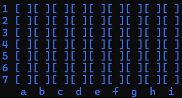
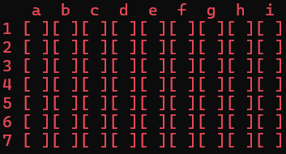
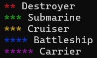
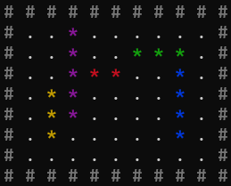

# C++ Language

<p align="center">

</p>
<p align="center">
    <a href="https://github.com/federico-busato/Modern-CPP-Programming/releases" alt="Release">
        
    </a>
</p>

<p align="center">
    <a alt="Stars">
        
    </a>
    <a href="https://github.com/federico-busato/Modern-CPP-Programming/network/members" alt="Forks">
        
    </a>
</p>
<p align="center">
    <a href="https://github.com/federico-busato/Modern-CPP-Programming/commits/master" alt="Commits">
        
    </a>
</p>
<p align="center">
    <a href="https://github.com/federico-busato/Modern-CPP-Programming-Material/issues" alt="Issues">
        
    </a>
</p>

# Penjelasan Game Battleship

<p align="center">


</p>
Game ini memiliki lebar map permainan yaitu 7 x 9 dan memiliki 5 macam kapal dalam permainan yaitu :

* Berwarna Merah ( 1 x 2 ) : Destroyer Ship
* Berwarna Hijau ( 1 x 3 ) : Submarine Ship
* Berwarna Kuning ( 1 x 3 ) : Cruiser Ship
* Berwarna Biru ( 1 x 4 ) : Battle Ship
* Berwarna Ungu ( 1 x 5 ) : Carrier Ship

<p align="center">

</p>

Game ini juga memiliki menu leaderboard yang kami ambil berdasarkan poin, poin kami ambil saat player benar menebak kapal dari ai dan juga sebaliknya. Pada leaderboard kami mengambil selisih terbesar kemenangan pada poin player pada ai. Game ini juga memiliki history game yang dapat membantu untuk melihat riwayat permainan pada semua menu dalam permainan battleship.
<br>
Game ini memiliki 2 mode yaitu VS AI dan juga 2 player. Pada VS AI kami memiliki 4 macam difficulty yaitu easy, medium, hard, dan juga Gacor !!!. Pada 4 macam difficulty tersebut kami membedakan nya dengan memberikan perbedaan celah kepada penebakan ai kepada map player. Pada mode 2 player, user bisa bermain 1v1 dengan 1 orang lain.

<p align="center">

</p>
Selanjutnya kami memberikan menu untuk meng setup 5 kapal pada map, game ini memiliki fitur randomize untuk me random semua posisi pada 5 kapal pada koordinat koordinat yang berbeda. Game ini juga memiliki fitur rotasi, jadi user bisa merotasi kapal menjadi vertikal maupun horizontal.
<br>
Pada saat permainan game kami memberikan cheat dengan memasukkan kode cheat yaitu 777 ( rahasia ) untuk melihat semua posisi kapal pada map ai maupun map player sendiri. Saat permainan game kami memberikan fitur yang dapat membantu kapal mana yang tersisa dan juga kapal mana yang belum di temukan dan juga jika koordinat semua kapal di temukan maka di map game ini maka kapal akan di munculkan.

# ARRAY mapBattleShip1
sebagai map player 1 dan juga map user saat melawan ai.

```c++
int mapBattleShip[9][11] = {
    {1, 1, 1, 1, 1, 1, 1, 1, 1, 1, 1},
    {1, 0, 0, 0, 0, 0, 0, 0, 0, 0, 1},
    {1, 0, 0, 0, 0, 0, 0, 0, 0, 0, 1},
    {1, 0, 0, 0, 0, 0, 0, 0, 0, 0, 1},
    {1, 0, 0, 0, 0, 0, 0, 0, 0, 0, 1},
    {1, 0, 0, 0, 0, 0, 0, 0, 0, 0, 1},
    {1, 0, 0, 0, 0, 0, 0, 0, 0, 0, 1},
    {1, 0, 0, 0, 0, 0, 0, 0, 0, 0, 1},
    {1, 1, 1, 1, 1, 1, 1, 1, 1, 1, 1},
};
```

# ARRAY mapBattleShip2
sebagai map player 2 dalam permainan mode 2 player.

```c++
int mapBattleShip2[9][11] = {
    {1, 1, 1, 1, 1, 1, 1, 1, 1, 1, 1},
    {1, 0, 0, 0, 0, 0, 0, 0, 0, 0, 1},
    {1, 0, 0, 0, 0, 0, 0, 0, 0, 0, 1},
    {1, 0, 0, 0, 0, 0, 0, 0, 0, 0, 1},
    {1, 0, 0, 0, 0, 0, 0, 0, 0, 0, 1},
    {1, 0, 0, 0, 0, 0, 0, 0, 0, 0, 1},
    {1, 0, 0, 0, 0, 0, 0, 0, 0, 0, 1},
    {1, 0, 0, 0, 0, 0, 0, 0, 0, 0, 1},
    {1, 1, 1, 1, 1, 1, 1, 1, 1, 1, 1},
};
```

# ARRAY mapBattleShipAi
sebagai map ai untuk mode permainan vs ai.

```c++
int mapBattleShipAi[9][11] = {
    {1, 1, 1, 1, 1, 1, 1, 1, 1, 1, 1},
    {1, 0, 0, 0, 0, 0, 0, 0, 0, 0, 1},
    {1, 0, 0, 0, 0, 0, 0, 0, 0, 0, 1},
    {1, 0, 0, 0, 0, 0, 0, 0, 0, 0, 1},
    {1, 0, 0, 0, 0, 0, 0, 0, 0, 0, 1},
    {1, 0, 0, 0, 0, 0, 0, 0, 0, 0, 1},
    {1, 0, 0, 0, 0, 0, 0, 0, 0, 0, 1},
    {1, 0, 0, 0, 0, 0, 0, 0, 0, 0, 1},
    {1, 1, 1, 1, 1, 1, 1, 1, 1, 1, 1},
};
```

# PROCEDURE welcomeText
untuk penggambaran animasi tulisan game saat game di mulai.

```c++
    int textMenu[15][36] = {
        {2, 0, 0, 0, 0, 0, 0, 0, 0, 0, 0, 0, 0, 0, 0, 0, 0, 0, 0, 0, 0, 0, 0, 0, 0, 0, 0, 0, 0, 0, 0, 0, 0, 0, 0, 2},
        {2, 0, 0, 1, 1, 1, 0, 0, 0, 0, 1, 1, 0, 0, 0, 1, 1, 1, 0, 0, 1, 1, 1, 0, 0, 1, 0, 0, 0, 0, 1, 1, 1, 0, 0, 2},
        {2, 0, 0, 1, 0, 0, 1, 0, 0, 1, 0, 0, 1, 0, 0, 0, 1, 0, 0, 0, 0, 1, 0, 0, 0, 1, 0, 0, 0, 0, 1, 0, 0, 0, 0, 2},
        {2, 0, 0, 1, 1, 1, 0, 0, 0, 1, 1, 1, 1, 0, 0, 0, 1, 0, 0, 0, 0, 1, 0, 0, 0, 1, 0, 0, 0, 0, 1, 1, 1, 0, 0, 2},
        {2, 0, 0, 1, 0, 0, 1, 0, 0, 1, 0, 0, 1, 0, 0, 0, 1, 0, 0, 0, 0, 1, 0, 0, 0, 1, 0, 0, 0, 0, 1, 0, 0, 0, 0, 2},
        {2, 0, 0, 1, 1, 1, 0, 0, 0, 1, 0, 0, 1, 0, 0, 0, 1, 0, 0, 0, 0, 1, 0, 0, 0, 1, 1, 1, 0, 0, 1, 1, 1, 0, 0, 2},
        {2, 0, 0, 0, 0, 0, 0, 0, 0, 0, 0, 0, 0, 0, 0, 0, 0, 0, 0, 0, 0, 0, 0, 0, 0, 0, 0, 0, 0, 0, 0, 0, 0, 0, 0, 2},
        {2, 0, 0, 0, 0, 0, 0, 0, 0, 3, 3, 3, 0, 0, 3, 0, 3, 0, 0, 3, 3, 3, 0, 0, 3, 3, 3, 0, 0, 0, 0, 0, 0, 0, 0, 2},
        {2, 0, 0, 0, 0, 0, 0, 0, 3, 0, 0, 0, 0, 0, 3, 0, 3, 0, 0, 0, 3, 0, 0, 0, 3, 0, 0, 3, 0, 0, 0, 0, 0, 0, 0, 2},
        {2, 0, 0, 0, 0, 0, 0, 0, 0, 3, 3, 0, 0, 0, 3, 3, 3, 0, 0, 0, 3, 0, 0, 0, 3, 0, 0, 3, 0, 0, 0, 0, 0, 0, 0, 2},
        {2, 0, 0, 0, 0, 0, 0, 0, 0, 0, 0, 3, 0, 0, 3, 0, 3, 0, 0, 0, 3, 0, 0, 0, 3, 3, 3, 0, 0, 0, 0, 0, 0, 0, 0, 2},
        {2, 0, 0, 0, 0, 0, 0, 0, 0, 0, 0, 3, 0, 0, 3, 0, 3, 0, 0, 0, 3, 0, 0, 0, 3, 0, 0, 0, 0, 0, 0, 0, 0, 0, 0, 2},
        {2, 0, 0, 0, 0, 0, 0, 0, 3, 3, 3, 0, 0, 0, 3, 0, 3, 0, 0, 3, 3, 3, 0, 0, 3, 0, 0, 0, 0, 0, 0, 0, 0, 0, 0, 2},
        {2, 0, 0, 0, 0, 0, 0, 0, 0, 0, 0, 0, 0, 0, 0, 0, 0, 0, 0, 0, 0, 0, 0, 0, 0, 0, 0, 0, 0, 0, 0, 0, 0, 0, 0, 2},
        {2, 2, 2, 2, 2, 2, 2, 2, 2, 2, 2, 2, 2, 2, 2, 2, 2, 2, 2, 2, 2, 2, 2, 2, 2, 2, 2, 2, 2, 2, 2, 2, 2, 2, 2, 2}
    };

    cout << lightBlack << "\n# # # # # # # # # # # # # # # # # # # # # # # # # # # # # # # # # # # #"                                    << defaultColor;
    cout << lightBlack << "\n#" << lightCyan << "                                                                     "                  << lightBlack << "#" << defaultColor; Sleep(100);
    cout << lightBlack << "\n#" << lightCyan << "                                   # #  ( )                          "                  << lightBlack << "#" << defaultColor; Sleep(100);
    cout << lightBlack << "\n#" << lightCyan << "                                ___#_#___|__                         "                  << lightBlack << "#" << defaultColor; Sleep(100);
    cout << lightBlack << "\n#" << lightCyan << "                                ___#_#___|__                         "                  << lightBlack << "#" << defaultColor; Sleep(100);
    cout << lightBlack << "\n#" << lightCyan << "                            _  |____________|  _                     "                  << lightBlack << "#" << defaultColor; Sleep(100);
    cout << lightBlack << "\n#" << lightCyan << "                     _=====| | |            | | |==== _              "                  << lightBlack << "#" << defaultColor; Sleep(100);
    cout << lightBlack << "\n#" << lightCyan << "               =====| |.---------------------------. | |====         "                  << lightBlack << "#" << defaultColor; Sleep(100);
    cout << lightBlack << "\n#" << lightCyan << " <---------------------'   .  .  .  .  .  .  .  .   '--------------/ "                  << lightBlack << "#" << defaultColor; Sleep(100);
    cout << lightBlack << "\n#" << lightCyan << "   " << char(92) << "                                                              /  " << lightBlack << "#" << defaultColor; Sleep(100);
    cout << lightBlack << "\n#" << lightCyan << "    " << char(92) << "____________________________________________________________/   " << lightBlack << "#" << defaultColor; Sleep(100);
    cout << endl;

    for(int i = 0; i < 15; i++){
        for(int j = 0; j < 36; j++){
            if (textMenu[i][j] == 1){
                cout << lightRed << char(254) << " " << defaultColor;
                Sleep(10);
            } else if (textMenu[i][j] == 2){
                cout << lightBlack << "# " << defaultColor;
            } else if (textMenu[i][j] == 3){
                cout << lightBlue << char(254) << " " << defaultColor;
                Sleep(10);
            } else {
                cout << "  ";
            }
        }
        cout << endl;
    }
```

# PROCEDURE displayMenu
untuk memunculkan menu - menu yang ada pada game ini, digunakan untuk : menu awal, menu memilih difficulty, menu untuk memilih mode, dan juga untuk keterangan mode yang di pilih.

```c++
void displayMenu(int selectedOption, int menuChoice, int &pick){
    system("cls");
    int theSize;
    vector<string> mainMenu = {"Play Game", "Leaderboard", "History", "\033[91mExit\033[0m"};
    vector<string> gamemodeMenu = {"VS AI", "2 Player", "Back"};
    vector<string> difficultyMenu = {"\033[32mBeginner\033[0m mode", "\033[33mIntermediate\033[0m mode", "\033[35mAdvanced\033[0m mode", "\033[31mGacor !!!\033[0m", "Back"};
    vector<string> shipMenu = {"\033[31m**\033[0m Destroyer", "\033[32m***\033[0m Submarine", "\033[33m***\033[0m Cruiser", "\033[34m****\033[0m Battleship", "\033[35m*****\033[0m Carrier", "Continue", "Back"};
    vector<string> lboardAndHistMenu = {"Beginner Mode", "Intermediate Mode", "Advanced Mode", "Gacor !!!", "Back"};
//    vector<string>
    while (true){
        system("cls");
        if (menuChoice == 1){
            theSize = mainMenu.size();
            cout << "== Welcome to \033[091mBATTLE\033[094mSHIP\033[0m ==" << endl;
            for (int i = 0; i < mainMenu.size(); i++){
                if (i == selectedOption)
                    cout << "> " << mainMenu[i] << endl;
                else
                    cout << "  " << mainMenu[i] << endl;
            }
        } else if (menuChoice == 2){
            theSize = gamemodeMenu.size();
            cout << lightBlack << "== Welcome to BATTLESHIP ==" << defaultColor << endl;
            cout << "  Play Game "<< lightGreen << "(Selected)" << defaultColor << endl;
            for (int i = 0; i < gamemodeMenu.size(); i++){
                if (i == selectedOption)
                    cout << "  > " << gamemodeMenu[i] << endl;
                else
                    cout << "    " << gamemodeMenu[i] << endl;
            }
            cout << lightBlack << "  Leaderboard" << endl;
            cout << "  History" << endl;
            cout << "  Exit" << defaultColor << endl;
        } else if (menuChoice == 3){
            theSize = difficultyMenu.size();
            cout << "== \033[091mBATTLE\033[094mSHIP\033[0m \033[96mArtificial Intelligence\033[0m ==" << endl;
            cout << "Choose the difficulty of your AI:" << endl;
            for (int i = 0; i < difficultyMenu.size(); i++){
                if (i == selectedOption)
                    cout << "> " << difficultyMenu[i] << endl;
                else
                    cout << "  " << difficultyMenu[i] << endl;
            }
        } else if (menuChoice > 3 && menuChoice < 10){
            theSize = shipMenu.size();

            string difficultyPick;
            string playerPick;
            if (menuChoice == 4) difficultyPick = "\033[92mBeginner\033[0m";
            if (menuChoice == 5) difficultyPick = "\033[93mIntermediate\033[0m";
            if (menuChoice == 6) difficultyPick = "\033[95mAdvanced\033[0m";
            if (menuChoice == 7) difficultyPick = "\033[091mGacor !!!\033[0m";
            if (menuChoice == 8) playerPick = "\033[094mPlayer 1\033[0m";
            if (menuChoice == 9) playerPick = "\033[091mPlayer 2\033[0m";

            if (menuChoice < 8){
                cout << "== You have selected " << difficultyPick << " Difficulty ==" << endl;
                cout << "Please set up the position of your ship :" << endl;
            } else if (menuChoice < 10){
                cout << "== \033[091mBATTLE\033[094mSHIP\033[0m \033[96mPlayerVSPlayer\033[0m ==" << endl;
                cout << "Please " << playerPick << " set up the position of your ship :" << endl;
            }
            for (int i = 0; i < shipMenu.size(); i++){
                if (i == selectedOption)
                    cout << "> " << shipMenu[i] << endl;
                else
                    cout << "  " << shipMenu[i] << endl;
            }
        } else if (menuChoice == 10 || menuChoice == 11){
            cout << lightBlack << "== Welcome to BATTLESHIP ==" << endl;
            cout << "  Play Game" << defaultColor << endl;
            if (menuChoice == 10){
                theSize = lboardAndHistMenu.size();
                cout << "  Leaderboard " << lightGreen << "(Selected)" << defaultColor << endl;
                for (int i = 0; i < lboardAndHistMenu.size(); i++){
                    if (i == selectedOption)
                        cout << "  > " << lboardAndHistMenu[i] << endl;
                    else
                        cout << "    " << lboardAndHistMenu[i] << endl;
                }
                cout << lightBlack << "  History" << endl;
                cout << "  Exit" << defaultColor << endl;
            } else {
                theSize = lboardAndHistMenu.size() + 1;
                lboardAndHistMenu.insert(lboardAndHistMenu.begin() + 4, "Versus Mode");
                cout << lightBlack << "  Leaderboard" << defaultColor << endl;
                cout << "  History " << lightGreen << "(Selected)" << defaultColor << endl;
                for (int i = 0; i < lboardAndHistMenu.size(); i++){
                    if (i == selectedOption)
                        cout << "  > " << lboardAndHistMenu[i] << endl;
                    else
                        cout << "    " << lboardAndHistMenu[i] << endl;
                }
                cout << lightBlack << "  Exit" << defaultColor << endl;
                lboardAndHistMenu.erase(lboardAndHistMenu.begin() + 4);
            }
        }
        char key = getch();
        if (key == 'w' || key == 'W') {
            selectedOption = (selectedOption - 1 + theSize) % theSize;
        }
        else if (key == 's' || key == 'S') {
            selectedOption = (selectedOption + 1) % theSize;
        }
        else if (key == '\r') {
            Beep(500, 80);
            system("cls");
            pick = selectedOption + 1;
            break;
        }
    }
}
```

# PROCEDURE displayBoard
untuk memunculkan map dengan kapal sesuai dengan warna nya masing masing dan map ini digunakan saat mengsetup semua kapal.

```c++
void displayBoard(int mapBattleShip[9][11]){
    for(int i = 0; i < 9; i++){
        for(int j = 0; j < 11; j++){
            if(mapBattleShip[i][j] == 1){
                cout << lightBlack << "# " << defaultColor;
            } else if(mapBattleShip[i][j] == 2){
                cout << "\033[31m*\033[0m ";
            } else if(mapBattleShip[i][j] == 3){
                cout << "\033[32m*\033[0m ";
            } else if(mapBattleShip[i][j] == 4){
                cout << "\033[33m*\033[0m ";
            } else if(mapBattleShip[i][j] == 5){
                cout << "\033[34m*\033[0m ";
            } else if(mapBattleShip[i][j] == 6){
                cout << "\033[35m*\033[0m ";
            } else {
                cout << char(250) << " ";
            }
        }
        cout << endl;
    }
}
```

# PROCEDURE displayBoardPlay
untuk memunculkan map yang memiliki 2 mode yaitu untuk memunculkan map mode cheat dan untuk memunculkan map dengan keterangan tebakan koordinat benar ataupun salah dan juga untuk memberikan penggunaan keterangan koordinat.

```c++
void displayBoardPlay(int mapBattleShip[9][11], string color, bool &cheat, int num1, int num2){
    int shipInMap[5] = {0, 0, 0, 0, 0};

    for(int i = 0; i < 9; i++){
        for(int j = 0; j < 11; j++){
            if(mapBattleShip[i][j] == 7){
                shipInMap[0]++;
            } else if (mapBattleShip[i][j] == 8){
                shipInMap[1]++;
            } else if (mapBattleShip[i][j] == 9){
                shipInMap[2]++;
            } else if (mapBattleShip[i][j] == 10){
                shipInMap[3]++;
            } else if (mapBattleShip[i][j] == 11){
                shipInMap[4]++;
            }
        }
    }

    if (!cheat){
        cout << color;
        for(int i = 0; i < 9; i++) {
            if (i == 0 || i == 8) {
                for (int j = 0; j < 11; j++) {
                    if(j == 0 || j == 10){
                        cout << "    ";
                    } else {
                        if (i == 0 || i == 8){
                            char letter = 'a' + j - 1;
                            cout << " " << letter << " ";
                        }
                    }
                }
            } else {
                for (int j = 0; j < 11; j++) {
                    if (mapBattleShip[i][j] == 1 && j == num2) {
                        cout << " " << i << " ";
                    } else if (mapBattleShip[i][j] == 1){
                        cout << "  " << i << " ";
                    } else if (mapBattleShip[i][j] == 7 && shipInMap[0] == 2){
                        cout << "[\033[31m*\033[0m" << color << "]";
                    } else if (mapBattleShip[i][j] == 8 && shipInMap[1] == 3){
                        cout << "[\033[32m*\033[0m" << color << "]";
                    } else if (mapBattleShip[i][j] == 9 && shipInMap[2] == 3){
                        cout << "[\033[33m*\033[0m" << color << "]";
                    } else if (mapBattleShip[i][j] == 10 && shipInMap[3] == 4){
                        cout << "[\033[34m*\033[0m" << color << "]";
                    } else if (mapBattleShip[i][j] == 11 && shipInMap[4] == 5){
                        cout << "[\033[35m*\033[0m" << color << "]";
                    } else if (mapBattleShip[i][j] == 7){
                        cout << "[O]";
                    } else if (mapBattleShip[i][j] == 8){
                        cout << "[O]";
                    } else if (mapBattleShip[i][j] == 9){
                        cout << "[O]";
                    } else if (mapBattleShip[i][j] == 10){
                        cout << "[O]";
                    } else if (mapBattleShip[i][j] == 11){
                        cout << "[O]";
                    } else if (mapBattleShip[i][j] == 12){
                        cout << "[X]";
                    } else {
                        cout << "[ ]";
                    }
                }
            }
            cout << endl;
        }
        cout << defaultColor;
    } else {
        cout << color;
        for(int i = 0; i < 9; i++) {
            if (i == 0 || i == 8) {
                for (int j = 0; j < 11; j++) {
                    if(j == 0 || j == 10){
                        cout << "    ";
                    } else {
                        if (i == 0 || i == 8){
                            char letter = 'a' + j - 1;
                            cout << " " << letter << " ";
                        }
                    }
                }
            } else {
                for (int j = 0; j < 11; j++) {
                    if (mapBattleShip[i][j] == 1 && j == num2){
                        cout << " " << i << " ";
                    } else if (mapBattleShip[i][j] == 1) {
                        cout << "  " << i << " ";
                    } else {
                        if(mapBattleShip[i][j] == 2){
                            cout << "[\033[31m*\033[0m" << color << "]";
                        } else if(mapBattleShip[i][j] == 3){
                            cout << "[\033[32m*\033[0m" << color << "]";
                        } else if(mapBattleShip[i][j] == 4){
                            cout << "[\033[33m*\033[0m" << color << "]";
                        } else if(mapBattleShip[i][j] == 5){
                            cout << "[\033[34m*\033[0m" << color << "]";
                        } else if(mapBattleShip[i][j] == 6){
                            cout << "[\033[35m*\033[0m" << color << "]";
                        } else if (mapBattleShip[i][j] == 7){
                            cout << "[O]";
                        } else if (mapBattleShip[i][j] == 8){
                            cout << "[O]";
                        } else if (mapBattleShip[i][j] == 9){
                            cout << "[O]";
                        } else if (mapBattleShip[i][j] == 10){
                            cout << "[O]";
                        } else if (mapBattleShip[i][j] == 11){
                            cout << "[O]";
                        } else if (mapBattleShip[i][j] == 12){
                            cout << "[X]";
                        } else {
                            cout << "[ ]";
                        }
                    }
                }
            }
            cout << endl;
        }
        cout << defaultColor;
    }
}
```

# PROCEDURE gerakKapal
untuk menggerakkan kapal saat setup pada map player. Pada procedure ini berisi code untuk menjalankan kapal menggunakan w/a/s/d dan juga r untuk rotasi pada kapal.

```c++
void gerakKapal(char gerak, int &x, int &y, int &shipLength, int modelsShip, bool &isHorizontal, int mapBatShip[9][11]) {
    for (int i = 0; i < shipLength; i++) {
        if (isHorizontal) {
            mapBatShip[y][x + i] = 0;
        } else {
            mapBatShip[y + i][x] = 0;
        }
    }

    if (gerak == 'w') {
        bool canMove = true;
        for (int i = 0; i < shipLength; i++) {
            if (isHorizontal) {
                if (mapBatShip[y - 1][x + i] != 0) {
                    canMove = false;
                    break;
                }
            } else {
                if (mapBatShip[y - 1][x] != 0) {
                    canMove = false;
                    break;
                }
            }
        }
        if (canMove) {
            y--;
        }
    } else if (gerak == 'a') {
        bool canMove = true;
        for (int i = 0; i < shipLength; i++) {
            if (isHorizontal) {
                if (mapBatShip[y][x - 1] != 0) {
                    canMove = false;
                    break;
                }
            } else {
                if (mapBatShip[y + i][x - 1] != 0) {
                    canMove = false;
                    break;
                }
            }
        }
        if (canMove) {
            x--;
        }
    } else if (gerak == 's') {
        bool canMove = true;
        for (int i = 0; i < shipLength; i++) {
            if (isHorizontal) {
                if (mapBatShip[y + 1][x + i] != 0) {
                    canMove = false;
                    break;
                }
            } else {
                if (mapBatShip[y + shipLength][x] != 0) {
                    canMove = false;
                    break;
                }
            }
        }
        if (canMove) {
            y++;
        }
    } else if (gerak == 'd') {
        bool canMove = true;
        for (int i = 0; i < shipLength; i++) {
            if (isHorizontal) {
                if (mapBatShip[y][x + shipLength] != 0) {
                    canMove = false;
                    break;
                }
            } else {
                if (mapBatShip[y + i][x + 1] != 0) {
                    canMove = false;
                    break;
                }
            }
        }
        if (canMove) {
            x++;
        }
    } else if (gerak == 'r') {
        bool canRotate = true;

        if (isHorizontal) {
            for (int i = 0; i < shipLength; i++) {
                if (y + i >= 11 || mapBatShip[y + i][x] != 0) {
                    canRotate = false;
                    break;
                }
            }
        } else {
            for (int i = 0; i < shipLength; i++) {
                if (x + i >= 9 || mapBatShip[y][x + i] != 0) {
                    canRotate = false;
                    break;
                }
            }
        }

        if (canRotate) {
            for (int i = 0; i < shipLength; i++)
                mapBatShip[y][x + i] = 0;
            isHorizontal = !isHorizontal;
        }
    }

    for (int i = 0; i < shipLength; i++) {
        if (isHorizontal) {
            mapBatShip[y][x + i] = modelsShip;
        } else {
            mapBatShip[y + i][x] = modelsShip;
        }
    }
}
```

# PROCEDURE spawnShip
untuk memastikan kapal muncul saat awal setup dengan posisi horizontal atau vertical.

```c++
void spawnShip(int shipLength, int &x, int &y, int modelsShip, bool &isHorizontal, int mapBatShip[9][11]){
    for(int i = 0; i < shipLength; i++){
        if (isHorizontal){
            mapBatShip[y][x + i] = modelsShip;
        } else {
            mapBatShip[y + i][x] = modelsShip;
        }
    }
}
```

# FUNCTION availableSpot
untuk pengecekan sebelum meletakkan kapal. Jika pada spawn terdapat nilai dari kapal lain pada mapBattleShip, maka function akan mengembalikan false. Sebaliknya jika pada spawn hanya terdapat nilai 0, function akan mengembalikan true.

```c++
bool availableSpot(int shipLength, int &x, int &y, int modelsShip, bool &isHorizontal, int mapBatShip[9][11]){
    for (int i = 0; i < shipLength; i++){
        if (isHorizontal){
            if (mapBatShip[y][x + i] != 0 && mapBatShip[y][x + i] != modelsShip)
                return false;
        } else {
            if (mapBatShip[y + i][x] != 0 && mapBatShip[y + i][x] != modelsShip)
                return false;
        }
    }
    return true;
}
```

# PROCEDURE deployShip
untuk menu saat menggerakkan kapal sesuai dengan kapal yang user pilih dengan memanggil procedure displayBoard untuk memunculkan map nya.

```c++
void deployShip(string name, char colorCode, int shipLength, int mapBatShip[9][11]){
    cout << "== " << name << " Ship \033[3" << colorCode << "m";
    for (int i = 0; i < shipLength; i++){
        cout << "*";
    }
    cout << "\033[0m ==" << endl << endl;
    displayBoard(mapBatShip);
    cout << endl;
    cout << "Press w/a/s/d to move your ship" << endl;
    cout << "Press enter to save the position of ship" << endl;
    cout << "Press r to rotate your ship" << endl;
    cout << "Press c to randomize" << endl;
}
```

# PROCEDURE placeOneShipRandomly
untuk memposisikan posisi yang di random pada 1 kapal.

```c++
void placeOneShipRandomly(int &x, int &y, int shipLength, int modelShip, int mapBatShip[9][11], string name, bool &isHr){
    bool canDeploy = false;
    int randomX;
    int randomY;
    int randomRotate;

    while (!canDeploy){
        canDeploy = true;
        randomX = 1 + rand() % 9;
        randomY = 1 + rand() % 7;
        randomRotate = rand() % 2;

//        cout << "Rotate: " << randomRotate << ", Coordinates: " << randomX << " and " << randomY << " of " << name << endl;
//        Sleep(200);

        for (int i = 0; i < shipLength; i++){
            if (randomRotate == 1){
                isHr = false;
            }
            if (isHr){
                if (randomX + i >= 10 || mapBatShip[randomY][randomX + i] != 0){
                    canDeploy = false;
//                    cout << "Failed attempt" << " of " << name << endl;
//                    Sleep(200);
                    break;
                }
            } else {
                if (randomY + i >= 8 || mapBatShip[randomY + i][randomX] != 0){
                    canDeploy = false;
//                    cout << "Failed attempt" << " of " << name << endl;
//                    Sleep(200);
                    break;
                }
            }
        }
        if (canDeploy){
//            cout << "Placing ship" << " of " << name << endl;
//            Sleep(200);
            x = randomX;
            y = randomY;
            for (int i = 0; i < shipLength; i++){
                if (isHr)
                    mapBatShip[y][x + i] = modelShip;
                else
                    mapBatShip[y + i][x] = modelShip;
            }
        }
    }
}
```

# PROCEDURE placeAllShipsRandomly
untuk memposisikan posisi yang di random pada semua kapal dan juga pengecekan ketersediaan map agar kapal tidak bertabrakan.

```c++
void placeAllShipsRandomly(int mapBatShip[9][11]){
    srand(time(0));

    for (int i = 1; i < 8; i++){
        for (int j = 1; j < 10; j++){
            if (mapBatShip[i][j] == 2 || mapBatShip[i][j] == 3 || mapBatShip[i][j] == 4 || mapBatShip[i][j] == 5 || mapBatShip[i][j] == 6)
                mapBatShip[i][j] = 0;
        }
    }
    isHrDestroyer = true; isHrSubmarine = true; isHrCruiser = true; isHrBattleship = true; isHrCarrier = true;

    placeOneShipRandomly(destroyerX, destroyerY, destroyerShipLength, destroyer, mapBatShip, "Destroyer", isHrDestroyer);
    placeOneShipRandomly(submarineX, submarineY, submarineShipLength, submarine, mapBatShip, "Submarine", isHrSubmarine);
    placeOneShipRandomly(cruiserX, cruiserY, cruiserShipLength, cruiser, mapBatShip, "Cruiser", isHrCruiser);
    placeOneShipRandomly(battleshipX, battleshipY, battleshipShipLength, battleship, mapBatShip, "Battleship", isHrBattleship);
    placeOneShipRandomly(carrierX, carrierY, carrierShipLength, carrier, mapBatShip, "Carrier", isHrCarrier);
//    system("pause");
}
```

# PROCEDURE deployAndOperateShip
untuk mengecek gerak keyboard saat mengsetup kapal yaitu saat menyimpan posisi kapal dan juga untuk merandom kapal.

```c++
void deployAndOperateShip(char gerak, char colorCode, int shipLength, int &x, int &y, int modelShip, bool &isHorizontal, bool &done, int mapBatShip[9][11], string name){
    spawnShip(shipLength, x, y, modelShip, isHorizontal, mapBatShip);
    deployShip(name, colorCode, shipLength, mapBatShip);
    gerak = getch();
    gerakKapal(gerak, x, y, shipLength, modelShip, isHorizontal, mapBatShip);

    if (gerak == '\r'){
        done = true;
    } else if (gerak == 'c'){
        placeAllShipsRandomly(mapBatShip);
    }
    system("cls");
}
```

# PROCEDURE risetMap
untuk mengosongkan map dan menghilangkan posisi semua kapal saat ingin mengsetup kapal lagi.

```c++
void risetMap(int mapBattleShip[9][11]){
    for(int i = 0; i < 9; i++){
        for(int j = 0; j < 11; j++){
            if(mapBattleShip[i][j] != 1 && mapBattleShip[i][j] != 0){
                mapBattleShip[i][j] = 0;
            }
        }
    }
}
```

# PROCEDURE risetCoordinate 
untuk mengembalikan posisi spawn kapal pada posisi koordinat x1 dan y1.

```c++
void risetCoordinate(bool &isHr, int &x, int &y){
    isHr = true;
    x = 1;
    y = 1;
}
```

# PROCEDURE ResetMapAndShips 
yaitu untuk menggabungkan kedua procedure di dalam 1 procedure untuk mempersingkat code dan juga penggunaan code berkala.

```c++
void resetMapAndShips(int mapBatShip[9][11]){
    risetCoordinate(isHrDestroyer, destroyerX, destroyerY);
    risetCoordinate(isHrSubmarine, submarineX, submarineY);
    risetCoordinate(isHrCruiser, cruiserX, cruiserY);
    risetCoordinate(isHrBattleship, battleshipX, battleshipY);
    risetCoordinate(isHrCarrier, carrierX, carrierY);
    risetMap(mapBatShip);

}
```

# FUNCTION validateCoodinateInput
untuk memvalidasi coordinate ascii yang di kirim oleh user ataupun ai saat menebak posisi kapal.

```c++
bool validateCoordinateInput(string coordinates){
    if (coordinates.size() > 2 || coordinates.size() < 2)
        return false;
    else {
        if (coordinates.at(0) < 96 || coordinates.at(0) > 105)
            return false;
        else if (coordinates.at(1) < 49 || coordinates.at(1) > 55)
            return false;
    }
    return true;
}
```

# FUNCTION processCoordinates
untuk mengubah ascii yang di kirim user dari a1 menjadi koordinat yang kami dapatkan yaitu x1 dan y1.

```c++
int processCoordinates(string coordinates){
    int num1 = coordinates.at(0) - 96; // a jadi 1, b jadi 2, dsb
    int num2 = coordinates.at(1) - 48;
    int decipher = num1 * 10 + num2;

    return decipher;
}
```

# PROCEDURE displayShipPlay
untuk memunculkan keterangan kapal pada permainan game, jika user ataupun ai berhasil menebak seluruh badan kapal maka pada procedure ini kapal akan di hilangankan dan menyisakan keterangan kapal yang belum di temukan.

```c++
void displayShipPlay(int mapBattleShip[9][11]){
    int shipLengthInMap[5] = {0, 0, 0, 0, 0};
    int shipLength[5] = {2, 3, 3, 4, 5};
    string shipColors[5] = {"\033[31m*\033[0m", "\033[32m*\033[0m", "\033[33m*\033[0m", "\033[34m*\033[0m", "\033[35m*\033[0m"};
    string destroyerDisplay, submarineDisplay, cruiserDisplay, battleshipDisplay, carrierDisplay;

    for(int i = 0; i < 9; i++){
        for(int j = 0; j < 11; j++){
            if(mapBattleShip[i][j] == 2){
                shipLengthInMap[0]++;
            } else if (mapBattleShip[i][j] == 3){
                shipLengthInMap[1]++;
            } else if (mapBattleShip[i][j] == 4){
                shipLengthInMap[2]++;
            } else if (mapBattleShip[i][j] == 5){
                shipLengthInMap[3]++;
            } else if (mapBattleShip[i][j] == 6){
                shipLengthInMap[4]++;
            }
        }
    }

    if(shipLengthInMap[0] != 0){
        for(int i = 0; i < shipLength[0]; i++){
            destroyerDisplay += shipColors[0];
        }
    } else {
        for(int i = 0; i < shipLengthInMap[0]; i++){
            destroyerDisplay += shipColors[0];
        }
    }

    if(shipLengthInMap[1] != 0){
        for(int i = 0; i < shipLength[1]; i++){
            submarineDisplay += shipColors[1];
        }
    } else {
        for(int i = 0; i < shipLengthInMap[1]; i++){
            submarineDisplay += shipColors[1];
        }
    }

    if(shipLengthInMap[2] != 0){
        for(int i = 0; i < shipLength[2]; i++){
            cruiserDisplay += shipColors[2];
        }
    } else {
        for(int i = 0; i < shipLengthInMap[2]; i++){
            cruiserDisplay += shipColors[2];
        }
    }

    if(shipLengthInMap[3] != 0){
        for(int i = 0; i < shipLength[3]; i++){
            battleshipDisplay += shipColors[3];
        }
    } else {
        for(int i = 0; i < shipLengthInMap[3]; i++){
            battleshipDisplay += shipColors[3];
        }
    }

    if(shipLengthInMap[4] != 0){
        for(int i = 0; i < shipLength[4]; i++){
            carrierDisplay += shipColors[4];
        }
    } else {
        for(int i = 0; i < shipLengthInMap[4]; i++){
            carrierDisplay += shipColors[4];
        }
    }

    cout << setw(5) << "  " << destroyerDisplay << "  " << submarineDisplay << "  " << cruiserDisplay << "  " << battleshipDisplay << "  " << carrierDisplay;
    cout << endl;
}
```

# FUNCTION AttackForAI
untuk menghasilkan koordinat pada ai sesuai dengan difficulty nya masing - masing untuk menebak map pada player.

```c++
string attackForAI(int mapBattleShip[9][11], int ctrShip, int ctrSend, string difficulty){
    int ctr = 0;
    int cy_ship[17];
    int cx_ship[17];
    int cy_guess[63];
    int cx_guess[63];
    int y, x;
    char yChar;
    string result;
    bool isSame;

    for(int i = 0; i < 9; i++){
        for(int j = 0; j < 11; j++){
            if(mapBattleShip[i][j] == 2 || mapBattleShip[i][j] == 3 || mapBattleShip[i][j] == 4 || mapBattleShip[i][j] == 5 || mapBattleShip[i][j] == 6){
                cx_ship[ctr] = i;
                cy_ship[ctr] = j;
                ctr++;
            }
        }
    }

    if (difficulty == "Easy"){
        if(ctrSend % 6 == 0){
            y = cy_ship[ctrShip];
            x = cx_ship[ctrShip];

            cy_guess[ctrSend] = y;
            cx_guess[ctrSend] = x;
        } else {
            do {
                x = rand () % 7 + 1;
                y = rand () % 9 + 1;

                isSame = true;
                for(int i = 0; i < ctrSend; i++){
                    if(cy_guess[i] != y && cx_guess[i] != x){
                        isSame = false;
                        break;
                    }
                }
            } while (isSame);

            cy_guess[ctrSend] = y;
            cx_guess[ctrSend] = x;
        }
    } else if (difficulty == "Medium"){
        if(ctrSend % 4 == 0){
            y = cy_ship[ctrShip];
            x = cx_ship[ctrShip];

            cy_guess[ctrSend] = y;
            cx_guess[ctrSend] = x;
        } else {
            do {
                x = rand () % 7 + 1;
                y = rand () % 9 + 1;

                isSame = true;
                for(int i = 0; i < ctrSend; i++){
                    if(cy_guess[i] != y && cx_guess[i] != x){
                        isSame = false;
                        break;
                    }
                }
            } while (isSame);

            cy_guess[ctrSend] = y;
            cx_guess[ctrSend] = x;
        }
    } else if (difficulty == "Hard"){
        if(ctrSend % 2 == 0){
            y = cy_ship[ctrShip];
            x = cx_ship[ctrShip];

            cy_guess[ctrSend] = y;
            cx_guess[ctrSend] = x;
        } else {
            do {
                x = rand () % 7 + 1;
                y = rand () % 9 + 1;

                isSame = true;
                for(int i = 0; i < ctrSend; i++){
                    if(cy_guess[i] != y && cx_guess[i] != x){
                        isSame = false;
                        break;
                    }
                }
            } while (isSame);

            cy_guess[ctrSend] = y;
            cx_guess[ctrSend] = x;
        }
    } else if (difficulty == "Gacor"){
        y = cy_ship[ctrShip];
        x = cx_ship[ctrShip];
    }

    yChar = 'a' + y - 1;
    result = string(1, yChar) + to_string(x);

    return result;
}
```

# PROCEDURE PositioningShips
untuk menu pemilihan setup kapal dan juga untuk memastikan bahwa kapal benar - benar di setup sepenuhnya.

```c++
void positioningShips(int mapBattleShip[9][11], bool &play, int selectShip){
    switch(selectShip){
        case 1:{
            do {
                if (availableSpot(destroyerShipLength, destroyerX, destroyerY, destroyer, isHrDestroyer, mapBattleShip))
                    deployAndOperateShip(gerak, '1', destroyerShipLength, destroyerX, destroyerY, destroyer, isHrDestroyer, done, mapBattleShip, "Destroyer");
                else {
                    cout << "\033[031mDestroyer\033[0m cannot be deployed!\nPlease move the current ship at the spawnpoint";
                    Sleep(1000);
                    break;
                }
            } while (!done);
            selectedOpt = 0;
        break;
        }
        case 2:{
            do {
                if (availableSpot(submarineShipLength, submarineX, submarineY, submarine, isHrSubmarine, mapBattleShip))
                    deployAndOperateShip(gerak, '2', submarineShipLength, submarineX, submarineY, submarine, isHrSubmarine, done, mapBattleShip, "Submarine");
                else {
                    cout << "\033[032mSubmarine\033[0m cannot be deployed!\nPlease move the current ship at the spawnpoint";
                    Sleep(1000);
                    break;
                }
            } while (!done);
            selectedOpt = 1;
        break;
        }
        case 3:{
            do {
                if (availableSpot(cruiserShipLength, cruiserX, cruiserY, cruiser, isHrCruiser, mapBattleShip))
                    deployAndOperateShip(gerak, '3', cruiserShipLength, cruiserX, cruiserY, cruiser, isHrCruiser, done, mapBattleShip, "Cruiser");
                else {
                    cout << "\033[033mCruiser\033[0m cannot be deployed!\nPlease move the current ship at the spawnpoint";
                    Sleep(1000);
                    break;
                }
            } while (!done);
            selectedOpt = 2;
        break;
        }
        case 4:{
            do {
                if (availableSpot(battleshipShipLength, battleshipX, battleshipY, battleship, isHrBattleship, mapBattleShip))
                    deployAndOperateShip(gerak, '4', battleshipShipLength, battleshipX, battleshipY, battleship, isHrBattleship, done, mapBattleShip, "Battle");
                else {
                    cout << "\033[034mBattleship\033[0m cannot be deployed!\nPlease move the current ship at the spawnpoint";
                    Sleep(1000);
                    break;
                }
            } while (!done);
            selectedOpt = 3;
        break;
        }
        case 5:{
            do {
                if (availableSpot(carrierShipLength, carrierX, carrierY, carrier, isHrCarrier, mapBattleShip))
                    deployAndOperateShip(gerak, '5', carrierShipLength, carrierX, carrierY, carrier, isHrCarrier, done, mapBattleShip, "Carrier");
                else {
                    cout << "\033[035mCarrier\033[0m cannot be deployed!\nPlease move the current ship at the spawnpoint";
                    Sleep(1000);
                    break;
                }
            } while (!done);
            selectedOpt = 4;
        break;
        }
        case 6:{
        int ctr = 0;

            for(int i = 0; i < 9; i++){
                for(int j = 0; j < 11; j++){
                    if(mapBattleShip[i][j] == 0){
                        ctr++;
                    }
                }
            }

            if (ctr == 46){
                play = true;
            } else {
                cout << "Please set up all the positions of your ships" << endl;
                Sleep(1000);
                system("cls");
                selectedOpt = 5;
            }
            break;
        }
    }
}

```

# STRUCT PlayerScore
untuk meng-group agar vector dibawah ini bisa jalan. 

```c++
vector<PlayerScore> easyLeaderboard;
vector<PlayerScore> mediumLeaderboard;
vector<PlayerScore> hardLeaderboard;
vector<PlayerScore> gacorLeaderboard;
vector<PlayerScore> versusHistory;
```

# PROCEDURE loadLeaderboard
untuk membuka file leaderboard AI dan Versus, serta sorting dari urutannya dan maksimal top 10.

```
void loadLeaderboard(vector<PlayerScore>& leaderboard, string type) {
    ifstream file("leaderboard_" + type + ".txt");
    if(file.is_open()) {
        leaderboard.clear();
        string line;
        while(getline(file, line)) {
            try {
                PlayerScore score;
                size_t pos1 = line.find(",");
                if(pos1 == string::npos) continue;

                size_t pos2 = line.find(",", pos1 + 1);
                if(pos2 == string::npos) continue;

                if(type == "versus") {

                    score.name = line.substr(0, pos1);
                    score.score = stoi(line.substr(pos1 + 1, pos2 - pos1 - 1));

                    string remainingData = line.substr(pos2 + 1);
                    size_t commaPos = remainingData.find(",");
                    if(commaPos != string::npos) {
                        score.name2 = remainingData.substr(0, commaPos);
                        remainingData = remainingData.substr(commaPos + 1);

                        commaPos = remainingData.find(",");
                        if(commaPos != string::npos) {
                            score.score2 = stoi(remainingData.substr(0, commaPos));
                            score.date = remainingData.substr(commaPos + 1);
                        }
                    }
                } else {

                    score.name = line.substr(0, pos1);
                    score.score = stoi(line.substr(pos1 + 1, pos2 - pos1 - 1));
                    score.date = line.substr(pos2 + 1);
                }

                score.isVersusMode = (type == "versus");
                leaderboard.push_back(score);
            } catch(const std::exception& e) {
                continue;
            }
        }
        file.close();

        if(type == "versus") {
            sort(leaderboard.begin(), leaderboard.end(),
                 [](const PlayerScore& a, const PlayerScore& b) {
                     return (a.score + a.score2) > (b.score + b.score2);
                 });
        } else {
            sort(leaderboard.begin(), leaderboard.end(),
                 [](const PlayerScore& a, const PlayerScore& b) {
                     return a.score > b.score;
                 });
        }
    }
}
```

# PROCEDURE saveLeaderboard
untuk mengsave hasil dengan format yang ditentukan.

```
void saveLeaderboard(const vector<PlayerScore>& leaderboard, string type) {
    ofstream file("leaderboard_" + type + ".txt");
    if(file.is_open()) {
        for(const auto& score : leaderboard) {
            if(type == "versus") {
                file << score.name << ","
                     << score.score << ","
                     << score.name2 << ","
                     << score.score2 << ","
                     << score.date << "\n";
            } else {
                file << score.name << ","
                     << score.score << ","
                     << score.date << "\n";
            }
        }
        file.close();
    }
}
```

# PROCEDURE initializeLeaderboards
untuk membuka file - file leaderboard.

```
void initializeLeaderboards() {
    loadLeaderboard(easyLeaderboard, "easy");
    loadLeaderboard(mediumLeaderboard, "medium");
    loadLeaderboard(hardLeaderboard, "hard");
    loadLeaderboard(gacorLeaderboard, "gacor");
    loadLeaderboard(versusHistory, "versus");
}
```

# PROCEDURE getUsername
untuk meminta username pada player dan mengreturn username tersebut.
```
string getUsername(string establishPlayer) {
    string username;
    bool validUsername = false;

    while (!validUsername) {
        system("cls");
        cout << "====== Enter Your Username ======\n\n";
        cout << establishPlayer << " (3-15 characters): ";
        cin >> username;

        if (username.length() < 3 || username.length() > 15) {
            cout << "\nUsername must be between 3 and 15 characters!\n";
            Sleep(1500);
            continue;
        }

        bool hasInvalidChar = false;
        for (char c : username) {
            if (!isalnum(c)) {
                hasInvalidChar = true;
                break;
            }
        }

        if (hasInvalidChar) {
            cout << "\nUsername can only contain letters and numbers!\n";
            Sleep(1500);
            continue;
        }

        validUsername = true;
    }

    return username;
}
```

# PROCEDURE addToLeaderboard
untuk mendapatkan nama dan menyimpan nama,skor,skorAI,waktu,dll.

```
void addToLeaderboard(string name, int playerScore, string difficulty) {
    PlayerScore newScore;
    newScore.name = name;
    newScore.score = playerScore;
    newScore.name2 = "AI";
    newScore.score2 = 340 - playerScore;

    time_t now = time(0);
    char* dt = ctime(&now);
    newScore.date = dt;
    newScore.isVersusMode = false;

    vector<PlayerScore>* targetLeaderboard = nullptr;
    string saveType;

    if(difficulty == "Easy") {
        targetLeaderboard = &easyLeaderboard;
        saveType = "easy";
    } else if(difficulty == "Medium") {
        targetLeaderboard = &mediumLeaderboard;
        saveType = "medium";
    } else if(difficulty == "Hard") {
        targetLeaderboard = &hardLeaderboard;
        saveType = "hard";
    } else if(difficulty == "Gacor") {
        targetLeaderboard = &gacorLeaderboard;
        saveType = "gacor";
    }

    if(targetLeaderboard != nullptr) {
        targetLeaderboard->push_back(newScore);
        sort(targetLeaderboard->begin(), targetLeaderboard->end(),
             [](const PlayerScore& a, const PlayerScore& b) {
                 return a.score > b.score;
             });
        saveLeaderboard(*targetLeaderboard, saveType);
    }
}

```

# PROCEDURE addToLeaderboard (2)
untuk mendapatkan nama dan menyimpan nama,skor,waktu,dll.

```
void addToLeaderboard(string name1, int score1, string name2, int score2, string difficulty) {
    PlayerScore newScore;
    newScore.name = name1;
    newScore.score = score1;
    newScore.name2 = name2;
    newScore.score2 = score2;

    time_t now = time(0);
    char* dt = ctime(&now);
    newScore.date = dt;
    newScore.isVersusMode = true;

    if(difficulty == "Versus") {
        versusHistory.push_back(newScore);
        sort(versusHistory.begin(), versusHistory.end(),
             [](const PlayerScore& a, const PlayerScore& b) {
                 return (a.score + a.score2) > (b.score + b.score2);
             });
        saveLeaderboard(versusHistory, "versus");
    }
}
```

# PROCEDURE displayLeaderboard
untuk mendisplay leaderboard di console.

```
void displayLeaderboard(string difficulty) {
    vector<PlayerScore>* currentLeaderboard;
    string difficultyTitle;

    if(difficulty == "Easy") {
        currentLeaderboard = &easyLeaderboard;
        difficultyTitle = "\033[92mBEGINNER MODE\033[0m";
    } else if(difficulty == "Medium") {
        currentLeaderboard = &mediumLeaderboard;
        difficultyTitle = "\033[93mINTERMEDIATE MODE\033[0m";
    } else if(difficulty == "Hard") {
        currentLeaderboard = &hardLeaderboard;
        difficultyTitle = "\033[95mADVANCED MODE\033[0m";
    } else {
        currentLeaderboard = &gacorLeaderboard;
        difficultyTitle = "\033[91mGACOR !!!\033[0m";
    }

    cout << "====== LEADERBOARD - " << difficultyTitle << " ======\n\n";
    cout << left << setw(5) << "Rank" << setw(15) << "Name" << setw(10) << "Score" << setw(30) << "Date" << endl;
    cout << "---------------------------------------------------------------\n";

    for(int i = 0; i < min(10, (int)currentLeaderboard->size()); i++) {
        cout << left
             << setw(5) << i + 1
             << setw(15) << (*currentLeaderboard)[i].name
             << setw(10) << (*currentLeaderboard)[i].score
             << setw(30) << (*currentLeaderboard)[i].date;

             cout << endl;
             cout << endl;
    }

    if(currentLeaderboard->empty()) {
        cout << "\nNo scores recorded yet!\n";
    }

    cout << "\nPress any key to continue...";
    _getch();
    system("cls");
}
```

# PROCEDURE displayHistory
untuk mendisplay history AI di console.

# PROCEDURE displayHistoryVersus
untuk mendisplay history khusus versus di console.

# PROCEDURE attackPhase
untuk memproses giliran dalam menebak koordinat kapal, untuk memproses pengamilan x dan y, perubahan symbol koordinat pada map, memberikan text keterangan kapal tidak ada ataupun tersisa berapa koordinat lagi yang harus di tebak, dan pengecekan untuk invalid coordinates.


